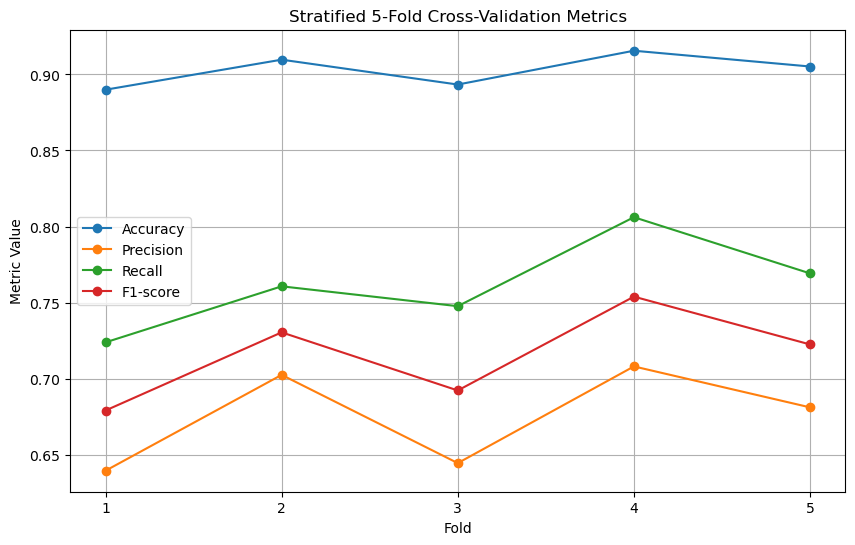
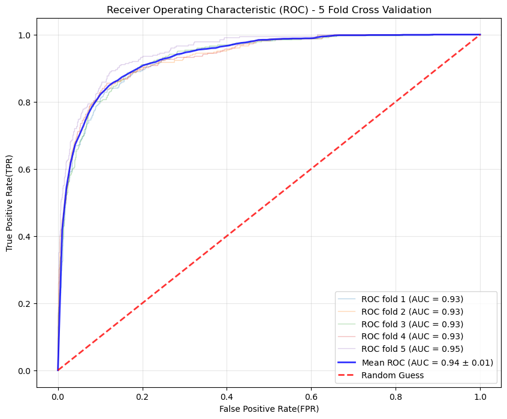

# NUMPY FOR DATA SCIENCE - CREDIT CARD CUSTOMER CHURN PREDICTION

## 🔍 Table of Contents
1.  [Title and Brief Description](#1-title-and-brief-description)
2.  [Introduction](#2-introduction)
    *   [Problem Description](#problem-description)
    *   [Motivation and Real-World Application](#motivation-and-real-world-application)
    *   [Specific Objectives](#specific-objectives)
3.  [Dataset](#3-dataset)
    *   [Data Source](#data-source)
    *   [Feature Description](#feature-description)
    *   [Data Size and Characteristics](#data-size-and-characteristics)
4.  [Method](#4-method)
    *   [Data Processing Workflow](#data-processing-workflow)
    *   [Algorithms Used](#algorithms-used)
    *   [NumPy Implementation Explanation](#numpy-implementation-explanation)
5.  [Installation & Setup](#5-installation--setup)
    * [Create Virtual Environment](#create-virtual-environment)
    * [Activate Environment](#activate-environment)
    * [Install Required Libraries](#install-required-libraries)
6.  [Usage](#6-usage)
7.  [Results](#7-results)
    * [Evaluation Metrics](#evaluation-metrics)
    * [Receiver Operating Characteristic (ROC) Curve](#receiver-operating-characteristic-roc-curve)
8.  [Project Structure](#8-project-structure)
9.  [Challenges & Solutions](#9-challenges--solutions)
10. [Future Improvements](#10-future-improvements)
11. [Contributors](#11-contributors)
12. [License](#12-license)

---

## 🔄 Workflow Pipeline Architecture

```mermaid
flowchart TB
    Start([Start]) --> LoadData[Load Raw Data<br/>BankChurners.csv]
    LoadData --> EDA[Exploratory Data Analysis<br/>01_data_exploration.ipynb]
    
    EDA --> CheckMissing{Check Missing<br/>Values?}
    CheckMissing -->|Yes| HandleMissing[Handle Missing Values<br/>using NumPy]
    CheckMissing -->|No| CheckOutliers
    HandleMissing --> CheckOutliers{Detect<br/>Outliers?}
    
    CheckOutliers -->|Yes| HandleOutliers[Handle Outliers<br/>Z-score/IQR method]
    CheckOutliers -->|No| FeatureEng
    HandleOutliers --> FeatureEng[Feature Engineering<br/>02_preprocessing.ipynb]
    
    FeatureEng --> Encoding[Encode Categorical Variables<br/>One-Hot/Ordinal Encoding]
    Encoding --> Normalize[Normalize/Standardize<br/>Numerical Features]
    Normalize --> Split[Split Dataset<br/>Train/Test Sets]
    
    Split --> Model[Build Logistic Regression<br/>NumPy Implementation<br/>03_modeling.ipynb]
    Model --> Train[Train Model<br/>Gradient Descent]
    Train --> CrossVal[Stratified 5-Fold<br/>Cross-Validation]
    
    CrossVal --> Evaluate[Evaluate Model<br/>Accuracy, Precision<br/>Recall, F1-Score]
    Evaluate --> ROC[Generate ROC Curve<br/>Calculate AUC]
    
    ROC --> SaveResults[Save Results<br/>metrics_plot.png<br/>roc_curve_plot.png]
    SaveResults --> SaveProcessed[Save Processed Data<br/>data/processed/]
    SaveProcessed --> End([End])
    
    style Start fill:#90EE90
    style End fill:#FFB6C1
    style Model fill:#87CEEB
    style Train fill:#87CEEB
    style Evaluate fill:#FFD700
    style ROC fill:#FFD700
```



---

## 1. Title and Brief Description

**Title:** Building a Customer Churn Prediction Model Using Credit Card Customer Information

**Brief Description:** This project aims to build a simple machine learning model to predict the likelihood of a credit card customer leaving the bank based on customer data and transaction history. The entire preprocessing, computation, and model building process is implemented using `NumPy` only, without using `Pandas` for data operations.

## 2. Introduction

### Problem Description
This is a **Classification** task: Based on customer information (gender, age, income, marital status, credit score, etc.) and card activity (number of transactions, total spending), predict whether the customer's account is **Attrited** or **Existing**.

### Motivation and Real-World Application
Predicting customer churn (Attrited Customer Prediction) is critical in the Banking and Finance industry.
*   **Motivation:** The cost of retaining an existing customer is significantly lower than acquiring a new one.
*   **Application:** The prediction model helps banks identify high-risk customers early, enabling timely deployment of retention strategies such as offering special incentives and improving customer service.

### Specific Objectives
1.  **Master NumPy:** Efficiently use `NumPy` for all tabular data processing tasks.
2.  **Data Analysis:** Formulate and answer questions about data through descriptive statistics and visualization (Matplotlib/Seaborn).
3.  **Model Building (Core/Advanced):**
    *   **Core:** Use only `NumPy` (or Scikit-learn) to build classification models (e.g., Logistic Regression).
4.  **Visualization:** Illustrate analysis results and model performance using Matplotlib and Seaborn.

## 3. Dataset

### Data Source
*   **Name:** Credit Card customers
*   **Source:** [Kaggle - Credit Card customers](https://www.kaggle.com/datasets/sakshigoyal7/credit-card-customers)
*   **Description:** The dataset contains detailed information about credit card customers of a bank, including demographic indicators, credit scores, and account status.

### Feature Description
Key features:
*   `CLIENTNUM`: Customer number (unique ID).
*   `Attrition_Flag`: Target variable (Existing Customer / Attrited Customer).
*   `Customer_Age`: Customer's age.
*   `Gender`: Gender.
*   `Dependent_count`: Number of dependents.
*   `Income_Category`: Annual income level.
*   `Card_Category`: Credit card type (Blue, Silver, Gold, Platinum).
*   `Credit_Limit`: Credit limit.
*   `Total_Trans_Amt`: Total transaction amount (in 12 months).
*   `Total_Trans_Ct`: Total number of transactions (in 12 months).
*   ...

### Data Size and Characteristics
*   **Size:** 10,127 rows, 23 columns.
*   **Characteristics:** The data includes numerical columns (Age, Credit Limit, Total Trans Amt, ...) and categorical columns (Gender, Income Category, Card Category). Requires handling of Missing Values, encoding categorical data, and normalization/standardization of numerical data.

## 4. Method

### Data Processing Workflow
1.  **Load Data:** Use NumPy functions (`np.genfromtxt`) to read data from files.
2.  **Preprocessing:**
    *   Check and handle Missing Values.
    *   Handle outliers using statistical techniques (e.g., Z-score, IQR).
    *   Encode categorical variables (Label Encoding, One-Hot Encoding, Ordinal Encoding) using NumPy array operations.
    *   Add new related features (Feature engineering)
3.  **Split Data:** Divide data into training set and testing set.

### Algorithms Used
*   **Algorithm:** `Logistic Regression`.
*   **Mathematical formulas for Logistic Regression:**
    *   Linear function: $z = \mathbf{w}^T \mathbf{x} + b$
    *   Sigmoid function (Activation function): $\sigma(z) = \frac{1}{1 + e^{-z}}$
    *   Loss function (Binary Cross-Entropy): 
    
    $L(\mathbf{w}, b) = -\frac{1}{m} \sum_{i=1}^{m} [y^{(i)} \log(\hat{y}^{(i)}) + (1 - y^{(i)}) \log(1 - \hat{y}^{(i)})]$

    *   Optimization algorithm: Gradient Descent (compute derivatives and update $\mathbf{w}, b$)

### NumPy Implementation Explanation
*   All vector and matrix operations (such as matrix multiplication `np.dot`, summation `np.sum`, exponentiation `np.exp`, overflow prevention `np.clip`) are used to implement the mathematical formulas in the `Logistic Regression` model mentioned above.
*   Use broadcasting in the `One-hot Encoding` function to create a matrix with new columns representing unique values of the feature to be encoded, with the number of rows equal to the number of data rows.
    - The unique array has size $(k, )$
    - The data column has shape $(n, 1)$
    - Due to the `broadcasting` mechanism, the unique array size becomes $(1, k)$ and finally both will have the same size $(n, k)$
*   Use `np.vectorize` to operate on all elements of the matrix without loops.
*   In the `Ordinal Encoding` function implementation, use fancy indexing with index numbers in the `inv` list to retrieve corresponding values, ...

## 5. Installation & Setup

### Create Virtual Environment
```bash
python -m venv venv
```
```

### Activate Environment

**For Windows (Command Prompt):**
```bash
venv\Scripts\activate.bat
```
**For Windows (PowerShell):**
```bash
.\venv\Scripts\Activate.ps1
```

**For macOS / Linux:**
```bash
source venv/bin/activate
```

### Install Required Libraries:
```bash
pip install -r requirements.txt
```

## 6. Usage

Step-by-step instructions to run the project:
- **Data Exploration:** Run [notebooks/01_data_exploration.ipynb](notebooks/01_data_exploration.ipynb) to understand the data, descriptive statistics, and initial analysis charts.
- **Preprocessing:** Run [notebooks/02_preprocessing.ipynb](notebooks/02_preprocessing.ipynb) to clean, handle Missing Values, encode, and normalize data.
- **Model Building:** Run [notebooks/03_modeling.ipynb](notebooks/03_modeling.ipynb) to train the model, evaluate performance, and make predictions.

**Note:** For each file, simply select `Run All` or `Restart & Run All` to execute the entire notebook.

## 7. Results

### Evaluation Metrics



- `Logistic Regression` combined with `Stratified 5-Fold Cross-Validation` shows that the model operates stably and reliably in predicting customer churn. While the model classifies Existing customers well, there is minor confusion with Attrited customers.

- `Precision` helps avoid false alarms, while `Recall` is crucial for customer retention problems – achieving promising levels, demonstrating the model's ability to detect at-risk customers. 

- High `F1-score` further reinforces the model's effectiveness under imbalanced data conditions. 

### Receiver Operating Characteristic (ROC) Curve



- **Excellent Performance:** The **Mean AUC of ~0.94** shows that the model's ability to classify between "Attrited" and "Existing" customers is significantly better than random guessing. This reinforces the high `F1-score` above, proving the model not only performs well at one point but across the entire data range.

- **High Stability:** The ROC curves of each Fold (faded lines) are very close to the average curve with small standard deviation. This is consistent with the stability of the `Accuracy` and `Recall` columns in the **Metrics** chart, confirming the model does not suffer from overfitting.

- **Recall Optimization:** The curve has a steep shape from the beginning of the horizontal axis, showing that the model can achieve high `Recall` (correctly catching churned customers) while keeping the False Positive rate low.

**Overall Conclusion:** The **Logistic Regression** model is a suitable and effective choice for this problem.

## 8. Project Structure

```
Credits_Card_customers-Numpy-DS/
├── README.md                   # Project overview, installation guide & License
├── requirements.txt            # List of required libraries (numpy, pandas...)
├── data/
│   ├── raw/                    # Raw initial data
│   └── processed/              # Data after cleaning and processing
├── notebooks/                  # Experimental and analysis workspace
│   ├── 01_data_exploration.ipynb # Exploratory Data Analysis (EDA)
│   ├── 02_preprocessing.ipynb  # Preprocessing, normalization, and dataset splitting
│   ├── 03_modeling.ipynb       # Model training and evaluation metrics calculation
│   ├── metrics_plot.png        # Visualization of evaluation metrics
│   └── roc_curve_plot.png      # ROC curve for model classification assessment
├── src/                        # Main source code (for reuse)
│   ├── __init__.py             # Marks this directory as a Python Package
│   ├── data_processing.py      # Functions for loading and processing data
│   ├── visualization.py        # Functions for creating Pie, Box, Histogram charts...
│   └── models.py               # Logistic Regression algorithm implementation (NumPy only)
```

## 9. Challenges & Solutions

- **Challenge 1:** Processing categorical/string variables using only NumPy (without Pandas).
    - **Solution:** Use techniques like manual mapping to numerical values and NumPy's masking/fancy indexing to implement One-Hot Encoding and Ordinal encoding.
- **Challenge 2:** Ensuring complete vectorization, avoiding for loops in matrix operations.
    - **Solution:** Maximize the use of NumPy functions and techniques like broadcasting, fancy indexing, and vectorize.

## 10. Future Improvements

- Experiment with dimensionality reduction techniques (e.g., PCA - self-implemented using NumPy).
- Improve optimization algorithms (e.g., using Adam instead of pure Gradient Descent).
- Experiment with more complex models (e.g., Linear Discriminant Analysis - LDA).

## 11. Contributors

Name: Cao Tiến Thành

Student ID: 23120088

Contact: caotienthanh1103@gmail.com

## 12. License

- MIT License

Copyright (c) 2025 [Cao Tien Thanh]
